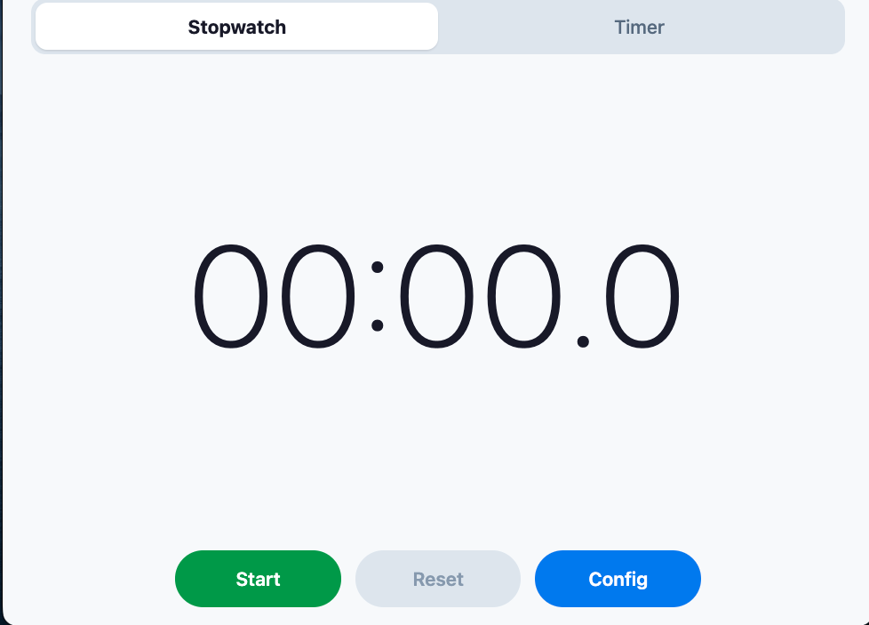
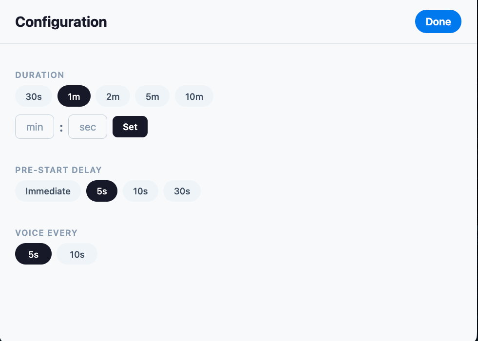

# Voice Stop Watch

A mobile stopwatch and countdown timer with **voice announcements**, built for hands-free use during workouts or any activity where you need to track time without looking at your screen.

## Why not just use the stock timer app?

Built-in stopwatch and timer apps on Android and iOS are silent — they show the time on screen and that's it. If you're mid-exercise with a dead-hang you can't keep glancing at your phone. You need the time spoken out loud.

Voice Stop Watch solves this by announcing the elapsed or remaining time at regular intervals using text-to-speech. You start it, put the phone down, and stay focused on what you're doing.

## Screenshots

### Main screen




## Features

- **Stopwatch mode** — counts up with periodic voice announcements of elapsed time
- **Countdown timer mode** — counts down from a configurable duration, announces remaining time at intervals, reads out the final 5 seconds individually, and announces "Time's up!"
- **Configurable speech intervals** — choose how often the time is spoken (e.g. every 5s, 10s, 30s)
- **Pre-start delay** — optional countdown with beep sounds before the timer begins, so you have time to get into position
- **Screen stays on** — the display won't dim or lock while the app is open
- **Works offline** — no internet connection needed

## Prerequisites

To develop and build the Android APK locally you need:

1. **Node.js** (v18+) — [nodejs.org](https://nodejs.org)
2. **Java JDK 17** — install via Homebrew on macOS:

```bash
 brew install --cask zulu@17
```

Then add to your shell profile (`~/.zshrc` or `~/.bashrc`): 3. **Android Studio** — for the Android SDK and `adb`:

```bash
 brew install --cask android-studio
```

Open Android Studio once and complete the setup wizard to install the SDK. Then add to your shell profile:

## Getting Started

```bash
npm install
```

## Development

Start the Expo dev server for quick iteration:

```bash
npm run restart
```

- Opens in a web browser automatically for quick testing
- To test on an Android phone: run `npx expo start`, then open **Expo Go** on the phone (same WiFi) and enter `exp://<your-mac-ip>:8081`

## Building and Installing the Android APK

Build the APK, then install it on a connected Android phone over USB in one command:

```bash
npm run deploy:android
```

This runs prebuild, compiles the release APK, and installs it via `adb`. Make sure USB debugging is enabled on your phone (Settings > Developer Options > USB Debugging).

You can also run the steps individually:

| Command                   | What it does                                   |
| ------------------------- | ---------------------------------------------- |
| `npm run build:android`   | Prebuild + compile the release APK             |
| `npm run install:android` | Install the APK onto a connected phone via adb |
| `npm run deploy:android`  | Both of the above in sequence                  |

The APK is output to `android/app/build/outputs/apk/release/app-release.apk`.

## Project Structure

```
App.tsx                        Main screen, keeps screen awake
src/
  hooks/
    useTimer.ts                Core timer logic (count up/down, 100ms tick)
    useDelayCountdown.ts       Pre-start delay with beep sounds
    useSpeech.ts               TTS announcements at configurable intervals
  components/
    TimeDisplay.tsx            Large centered time display
    Controls.tsx               Start/Pause, Reset, Config buttons
    ModeToggle.tsx             Stopwatch / Timer toggle
    ConfigScreen.tsx           Settings modal
    DelaySelector.tsx          Pre-start delay options
    SpeechConfig.tsx           Speech interval toggle
    DurationPicker.tsx         Timer duration presets + custom input
    DelayOverlay.tsx           Full-screen countdown during delay phase
  utils/
    formatTime.ts              Time formatting for display and speech
    sounds.ts                  Sound loading and playback
```

## Tech Stack

- React Native with Expo SDK 54
- TypeScript
- `expo-speech` — text-to-speech announcements
- `expo-keep-awake` — prevents screen from sleeping
- `expo-av` — beep sounds during pre-start delay
- `react-native-safe-area-context` — proper layout on Android/iOS
- `react-native-web` — browser testing
